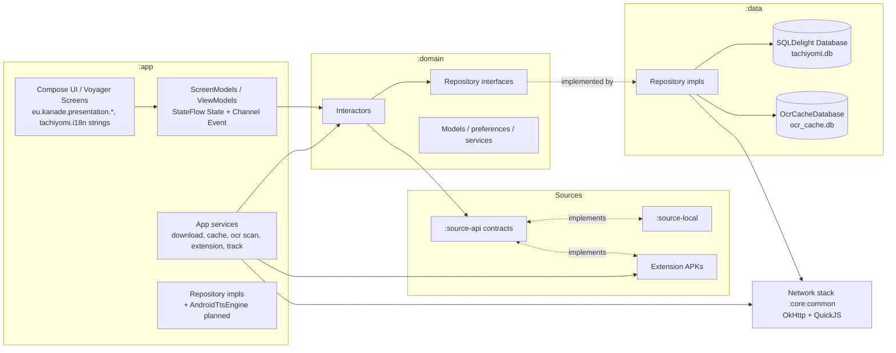

# Yomihon — Architecture

> Status: living document. Describes HOW the system is built.
> Documents the ACTUAL architecture first, then the planned TTS architecture.
> WHAT belongs in `docs/prd.md`; rules in `docs/rules.md`; progress in `docs/memory.md`.
> All paths verified against the repository (branch `main`, v0.4.0).

---

## 1. System overview

Yomihon is a Gradle multi-module Android app (Kotlin 2.4, Jetpack Compose,
minSdk 26 / targetSdk 36 / compileSdk 37). Layering follows a clean-ish
architecture: **UI (:app presentation) → interactors (:domain) → repositories
(interfaces :domain, impls :data/:app) → sources/network**. DI is **Injekt**
(no Hilt/Koin/Dagger). Navigation is **Voyager** screens + Compose.



### Modules (`settings.gradle.kts`)

| Module | Namespace | Responsibility |
|---|---|---|
| `:app` | `eu.kanade.tachiyomi` | Application: entrypoints (`App.kt`, `ui/main/MainActivity.kt`), all screens, reader, DI wiring (`AppModule`, `PreferenceModule`, `DomainModule`), WorkManager jobs, caches, extension manager, trackers, OCR scan runtime |
| `:domain` | `tachiyomi.domain` (+ `mihon.domain.*`) | Models, repository interfaces, interactors, preference/service classes (`OcrPreferences`, dictionary audio interfaces) — pure Kotlin/Android-free where possible |
| `:data` | `tachiyomi.data` (+ `mihon.data.*`) | Repository implementations; two SQLDelight schemas (`Database`, `OcrCacheDatabase`); OCR engines; panel detection |
| `:source-api` | `eu.kanade.tachiyomi.source` | Source contracts (`HttpSource`, filters, `SManga`/`SChapter`/`Page`) |
| `:source-local` | `tachiyomi.source.local` | Local source: folders/archives/EPUB |
| `:core:common` | `eu.kanade.tachiyomi.core.common` | Network stack (`NetworkHelper`, interceptors, DoH), `PreferenceStore`, storage helpers, QuickJS engine |
| `:core:archive` | `mihon.core.archive` | libarchive-based archive reading |
| `:core-metadata` | `tachiyomi.core.metadata` | Manga metadata/title parsing |
| `:i18n` | `tachiyomi.i18n` | moko-resources strings (base only hand-edited) |
| `:presentation-core` | `tachiyomi.presentation.core` (+ `mihon.presentation.core`) | Shared Compose components (`SettingsItems`, `AdaptiveSheet`, `Pill`, …), i18n helper |
| `:presentation-widget` | `tachiyomi.presentation.widget` | Glance "Upcoming" widget |
| `:telemetry` | `mihon.telemetry` | Firebase wrapper; real/noop source-set swap via `-Pinclude-telemetry` |
| `:baseline-profile` | `mihon.baselineprofile` | Baseline profile generator (GMD pixel6Api34) |

Dependency direction: `:app → everything`; `:data → :domain → :source-api`;
`:presentation-* → :i18n/:core:common`. Never introduce cycles
(see `docs/rules.md`).

---

## 2. Application flow

```text
Process start
  → App.onCreate()                        (app/src/main/java/eu/kanade/tachiyomi/App.kt)
      → patchInjekt(); Injekt.importModule(PreferenceModule) / (AppModule) / (DomainModule)
      → Coil image loader factory (OkHttp client from NetworkHelper)
  → MainActivity (single activity, ui/main/)
      → Voyager Navigator → HomeScreen (tabs: Library, History, Updates, Browse, More)
  → Library / Browse(source/extension) / History / Updates / More(settings…)
  → MangaScreen → Chapters → ReaderActivity (explicit Activity, not Voyager)
      → ReaderViewModel.init(manga, chapter)
          → ChapterLoader → page loaders → Viewer rendering
          → OCR early-init; tap-to-lookup / region selection / background scans
      → [planned] Read-Aloud TTS on top of cached/scanned OCR results
```

Cross-cutting services started from screens/jobs: `DownloadManager`,
`LibraryUpdateJob`, `OcrScanJob` (WorkManager), `BackupCreatorJob`,
tracking sync, updater (flag-gated).

---

## 3. Reader flow (actual)

Key files:

- `app/src/main/java/eu/kanade/tachiyomi/ui/reader/ReaderActivity.kt`
- `app/src/main/java/eu/kanade/tachiyomi/ui/reader/ReaderViewModel.kt`
- `app/src/main/java/eu/kanade/tachiyomi/ui/reader/viewer/**` (`Viewer` interface,
  `PagerViewer` + L2R/R2L/Vertical, `WebtoonViewer`)
- `app/src/main/java/eu/kanade/tachiyomi/ui/reader/loader/**` (`ChapterLoader`,
  `HttpPageLoader`, `DownloadPageLoader`, `ArchivePageLoader`, `EpubPageLoader`,
  `DirectoryPageLoader`)
- models: `ui/reader/model/{ReaderChapter,ReaderPage,ViewerChapters,ChapterTransition,InsertPage}`

Flow:

1. **Open**: `ReaderActivity.newIntent(manga, chapter)` → `viewModel.init(...)`
   loads manga, builds filtered `chapterList`, creates `ChapterLoader`, eagerly
   initializes the OCR model ("Initialize OCR model early", VM init).
   Process-death restore via `SavedStateHandle(chapter_id, page_index)`.
2. **Load chapter**: `ChapterLoader.getPageLoader()` picks loader by source type:
   downloaded → `DownloadPageLoader`; LocalSource format → Directory/Archive/Epub;
   else `HttpPageLoader`.
3. **Load pages**: `HttpPageLoader.getPages()` reads the page list from
   **ChapterCache** first, else `source.getPageList()`; image requests go through
   a priority queue (RETRY > DEFAULT > ADJACENT), preload next 4 pages, images
   cached to disk (`ChapterCache`, DiskLruCache 100 MiB).
4. **Display**: `ViewerChapters` wrapped in adapters; `PagerViewer` (ViewPager)
   or `WebtoonViewer` (RecyclerView) render pages via Coil +
   `ReaderPageImageView` (subsampling for tall images). Page changes call
   `activity.onPageSelected(page)` → `ReaderViewModel.onPageSelected` persists
   progress, marks read, tracks, triggers downloads, emits `Event.PageChanged`.
5. **Navigation**: toolbar/keyboard `loadNextChapter`/`loadPreviousChapter`;
   adjacent chapters preloaded (`preload`); transitions rendered between chapters;
   dual-page split and InsertPage handled inside pager adapters.
6. **State**: single `MutableStateFlow<State>` in `ReaderViewModel`
   (`@Immutable State`: manga, viewerChapters, currentPage, dialog, menuVisible,
   ocrSelectionMode, isProcessingOcr, brightnessOverlayValue, …).
7. **VM→Activity events**: `Channel<Event>` exposed as `eventFlow`, collected in
   `ReaderActivity.onCreate` (~l.326): ReloadViewerChapters, PageChanged,
   SetOrientation, SetCoverResult, SavedImage/ShareImage/CopyImage, Ocr* errors.
8. **Lifecycle**: viewers destroyed in `onDestroy`; `ReaderViewModel.onCleared()`
   calls `OcrRepository.cleanup()` / `PanelDetectionRepository.cleanup()`.
   Compose overlays rendered via `binding.setComposeOverlay()` +
   `ContentOverlay(...)` (app bars, OCR selection overlay, dialogs,
   `OcrLoadingIndicator` at BottomCenter).

---

## 4. OCR flow (actual)

Engines live in `data/src/main/java/mihon/data/ocr/`; contracts/models in
`domain/src/main/java/mihon/domain/ocr/`.

```text
Entry points
  A. Tap-to-lookup     : cached OcrPageResult hit-test → Dialog.OcrResult
  B. Region selection  : bottom-bar button or long-press → drag rect
                         → viewer.resolveSelectionCaptures → ReaderSelectionCropper
                         → OcrProcessor.getText(bitmap.toOcrImage())
                         → flattenOcrTextForQuery → dictionary search
  C. Background scan   : OcrScanManager queue → OcrScanJob (WorkManager)
                         → OcrChapterScanner (per page: resolve bitmap → ScanPageOcr)
  D. [planned] TTS     : GetCachedPageOcr / ScanPageOcr per page → segmenter → speech

Engine pipeline (repository-serialized)
  OcrRepositoryImpl.scanPage(model, …)
    → engineFor(model): Legacy(LiteRT local) | Fast(TFLite local)
                        | Glens(HTTP) | OwOcr(WebSocket self-hosted)
    → fallback chain if enabled (GLENS↔FAST, LEGACY→GLENS, OWOCR→GLENS)
    → PrioritizedTaskQueue + OcrEngineLocks serialize all engine work
    → TextPostprocessor normalizes lines (whitespace collapse, …→"...", half→full width)
    → OcrCacheStore.upsert(page + regions)
```

Result representation (`domain/.../mihon/domain/ocr/model/OcrModels.kt`):

- `OcrRegion(order: Int, text: String, boundingBox: OcrBoundingBox, textOrientation)`
  — bounding boxes are normalized floats; orientation ∈ {Horizontal, Vertical}.
- `OcrPageResult(chapterId, pageIndex, ocrModel, imageWidth, imageHeight, regions)`
  with computed flattened `text`.

Ordering rules & caveats (important for TTS):

- GLENS orders vertical bubbles right→left/top→bottom then horizontal top→bottom
  and strips furigana geometrically (`GlensOcrEngine.filterRuby`). OWOCR derives
  orientation from `writing_direction`.
- The local detect+recognize path (`scanLocally`) currently uses raw detection
  index as `order` with hardcoded Horizontal orientation, and its detection
  engine stub always throws (`UnavailableDetOcrEngine` TODO) so it redirects to
  Glens when fallbacks are enabled. **Known gap**: do not silently re-order;
  document instead (see prd.md §Future).
- Cache returns regions sorted by `region_order`; latest model wins per page.

Error handling: `OcrException` hierarchy (InitializationError, ConnectionError,
DetectionUnavailable); reader maps outcomes to `Event.OcrNoTextFound /
OcrMemoryError / OcrInitializationError / OcrError` → toasts.

ML model assets are gitignored and absent from fresh clones
(`app/src/main/assets/ocr/*`, `app/src/main/assets/ocr_fast/*`,
`data/src/main/assets/panel_detector/model.tflite`); CI downloads them with
pinned sha256 (`.github/workflows/build.yml`).

---

## 5. TTS flow (planned — approved design from root `architect.md`)

```text
[▶ tapped] → ReaderViewModel.startTts()
  → TtsPlaybackController.start()                    (viewModelScope, :app)
      ├─ AndroidTtsEngine.initialize()               (main thread, CompletableDeferred bridge)
      ├─ preflight isLanguageAvailable(JAPANESE)     → else Error(NoJapaneseVoice)
      ├─ requestAudioFocus(AUDIOFOCUS_GAIN)
      └─ per page N:
           1. TEXT     GetCachedPageOcr.await(chapterId, N)         ← ocr_cache.db
                         miss → OcrPageSourceResolver.resolve(...)
                                  → openBitmap → ScanPageOcr (persists) → recycle bitmap
           2. SEGMENT  List<OcrRegion> → SentenceSegmenter.toTtsSentences()   (pure, :domain)
           3. SPEAK    engine.speak("pN-sI", sentence.text)          (suspends until done/error)
           4. ADVANCE  TtsAdvancePolicy.computeAdvance(...)          (pure, :domain)
                         NextPage    → Event.TtsAdvancePage(N+1) → activity.moveToPageIndex
                         NextChapter → Event.TtsAdvanceChapter  → activity.loadNextChapter
                         Finish      → state=Finished, abandon focus
           [prefetch] ensure-OCR job for N+1; cancelled on any page change
```

Layering (extensible for future engines):

```text
Reader UI (Compose bar)            :app  eu.kanade.presentation.reader.TtsPlaybackBar
ReaderViewModel                    :app  ui/reader/ReaderViewModel (ttsState in State)
TtsPlaybackController              :app  ui/reader/tts/  (orchestration only)
TtsEngine interface                :domain mihon/domain/tts/engine/TtsEngine.kt
SentenceSegmenter / AdvancePolicy  :domain mihon/domain/tts/       (pure, unit-tested)
TtsPreferences                     :domain mihon/domain/tts/service/TtsPreferences.kt
AndroidTtsEngine                   :app  data/tts/AndroidTtsEngine.kt
  └─ android.speech.tts.TextToSpeech + AudioManager/AudioFocusRequest (framework)
future: CloudTtsEngine / NeuralTtsEngine implement TtsEngine without touching reader
```

Design rules (binding):

- Ordering: consume regions in stored order; never re-sort in the segmenter.
- Segmentation never merges across regions; terminal punct `。！？!?‼⁇⁉⁈` only.
- Controller never touches `Viewer` directly — advances go through existing
  `Event`s handled by `ReaderActivity.moveToPageIndex/loadNextChapter`;
  user swipes mid-playback win (rebuild queue for new page).
- Threading: all `TextToSpeech` calls on main (needs Looper); IO for bitmaps/DB;
  controller body in `viewModelScope`; no bitmaps across suspension points
  outside an acquire/finally-recycle block.
- Lifecycle matrix (pause on onStop, continue through rotation, shutdown on
  finish/onCleared, audio-focus handling) — see prd.md §F6 and root architect.md.
- No new caching layer in v1; no foreground service/MediaSession/permissions.

---

## 6. Folder structure (actual)

```text
yomihon/
├── app/                                # :app — application module
│   └── src/main/java/
│       ├── eu/kanade/tachiyomi/
│       │   ├── App.kt                  # Application: Injekt bootstrap, Coil factory
│       │   ├── di/                     # AppModule, PreferenceModule (Injekt)
│       │   ├── ui/                     # Voyager screens: main/, library/, history/,
│       │   │                           #   updates/, browse/, more/, reader/, download/,
│       │   │                           #   setting/, dictionary/, manga/, migration/…
│       │   │   └── reader/             # ReaderActivity, ReaderViewModel, viewer/, loader/,
│       │   │                           #   model/, setting/
│       │   ├── data/                   # cache/(ChapterCache,CoverCache), download/, backup/,
│       │   │                           #   ocr/(OcrScanJob,OcrScanManager,OcrChapterScanner),
│       │   │                           #   dictionary/(audio import jobs), coil/, track/, saver/
│       │   ├── extension/              # ExtensionManager, ExtensionLoader, installers
│       │   └── network/                # TrustedFileDownloader (stack itself in :core:common)
│       ├── eu/kanade/domain/           # DomainModule.kt (Injekt repos+interactors)
│       ├── eu/kanade/presentation/     # Compose UI per feature incl. theme/, reader/
│       └── mihon/                      # core/designsystem, core/migration, feature/{migration,ocr,…}
├── domain/src/main/java/
│   ├── tachiyomi/domain/               # category/chapter/history/library/manga/release/
│   │                                   #   source/track/updates/storage/download/backup services
│   └── mihon/domain/                   # ocr/ (model, repository, interactor, service/OcrPreferences),
│                                       #   dictionary/ (models, parser, audio/), ankidroid/, panel/,
│                                       #   extension/, upcoming/
├── data/src/main/
│   ├── java/mihon/data/ocr/            # OcrRepositoryImpl, engines, TextPostprocessor,
│   │                                   #   PrioritizedTaskQueue, OcrEngineLocks, OcrCacheStore
│   ├── java/tachiyomi/data/            # repository impls, DatabaseAdapter
│   ├── sqldelight/tachiyomi/           # main .sq files + migrations/1..17.sqm
│   └── sqldelight-ocr/tachiyomi/data/ocr/ocr_cache.sq
├── source-api/src/                     # commonMain eu.kanade.tachiyomi.source contracts
├── source-local/src/                   # expect/actual LocalSource
├── core/common/src/main/kotlin/        # network/, preference/, storage/, util/
├── core/archive/                       # libarchive wrapper
├── core-metadata/                      # metadata parsing
├── i18n/src/commonMain/moko-resources/base/strings.xml   # ONLY editable locale
├── presentation-core/src/main/java/    # shared Compose components + i18n helper
├── presentation-widget/                # Glance widget
├── telemetry/                          # firebase/noop source sets
├── baseline-profile/                   # GMD baseline generator
├── gradle/build-logic/                 # included build: convention plugins (PluginAndroidBase,
│                                       #   PluginSpotless, …) + mihon.versions.toml catalog
└── docs/                               # THIS documentation system
```

---

## 7. File responsibilities (TTS-related)

### Existing files being reused (no duplication)

| File | Reuse |
|---|---|
| `domain/.../mihon/domain/ocr/interactor/GetCachedPageOcr.kt` | Cached text source |
| `domain/.../mihon/domain/ocr/interactor/ScanPageOcr.kt` + `WithOcrScanSession.kt` | On-demand scan + session accounting |
| `app/.../data/ocr/OcrPageSourceResolver.kt` (+ Gateway/BitmapDecoder) | Bitmap acquisition for uncached pages |
| `domain/.../mihon/domain/ocr/model/OcrModels.kt` | `OcrRegion` input to segmentation; normalization fns |
| `data/.../mihon/data/ocr/TextPostprocessor.kt` | Already-normalized region text |
| `app/.../ui/reader/ReaderViewModel.kt` | Host controller; `State.ttsState`; event emission |
| `app/.../ui/reader/ReaderActivity.kt` | Event handling (`moveToPageIndex` ~l.1111, `loadNextChapter` ~l.1122), overlay composition |
| `app/.../presentation/reader/OcrLoadingIndicator.kt` | Visual template for the playback bar |
| `app/.../presentation/reader/settings/ReaderSettingsDialog.kt` | Tab host for new settings page |
| `app/.../di/AppModule.kt`-style modules (`DomainModule.kt`, `di/PreferenceModule.kt`) | DI registration points |
| `domain/.../mihon/domain/dictionary/audio/DictionaryAudioPlayer.kt` | Interface-in-domain precedent (pattern only; left untouched) |

### New files planned

| File | Responsibility |
|---|---|
| `domain/src/main/java/mihon/domain/tts/engine/TtsEngine.kt` | Framework-free engine contract: initialize, language availability, suspend speak(utteranceId,text), rate/pitch, audio-focus hooks, stop, shutdown |
| `domain/src/main/java/mihon/domain/tts/SentenceSegmenter.kt` | Pure `List<OcrRegion>.toTtsSentences(): List<TtsSentence>` (region-boundary-respecting split) |
| `domain/src/main/java/mihon/domain/tts/TtsAdvancePolicy.kt` | Pure advance decision function (NextPage/NextChapter/Finish/PauseAtPageEnd) |
| `domain/src/main/java/mihon/domain/tts/service/TtsPreferences.kt` | rate, pitch, auto page turn, auto next chapter, keep-screen-on prefs |
| `domain/src/test/java/mihon/domain/tts/SentenceSegmenterTest.kt` | Segmenter suite |
| `domain/src/test/java/mihon/domain/tts/TtsAdvancePolicyTest.kt` | Policy suite |
| `app/src/main/java/eu/kanade/tachiyomi/data/tts/AndroidTtsEngine.kt` | `TextToSpeech` + audio focus implementation of `TtsEngine` |
| `app/src/main/java/eu/kanade/tachiyomi/ui/reader/tts/TtsPlaybackController.kt` | Orchestration: text→segment→speak→advance loop, prefetch, arbitration |
| `app/src/main/java/eu/kanade/presentation/reader/TtsPlaybackBar.kt` | Mini playback pill |
| `app/src/main/java/eu/kanade/presentation/reader/settings/ReadAloudSettingsPage.kt` | Settings tab content |

Modified files (integration points): `DomainModule.kt` (engine binding),
`PreferenceModule.kt` (prefs binding), `ReaderViewModel.kt` (controller host,
`ttsState`, new Events, stop-on-finish), `ReaderActivity.kt` (new event branches,
bar rendering, onStop pause, keep-screen-on), `ReaderSettingsDialog.kt`
(new tab), `ReaderBottomBar.kt` (entry icon), `i18n base strings.xml` (snake_case keys).

---

## 8. Data flow

```text
UI (Compose) ──collect──> ScreenModel/ViewModel State (StateFlow, @Immutable data classes)
UI events ──calls──> ViewModel methods ──await──> Interactors (:domain)
Interactors ──await──> Repository interfaces (:domain) ──impl──> :data (SQLDelight) / :app services
Reader: Viewer callbacks → ReaderActivity → ReaderViewModel (state + Channel<Event> back)
OCR:    reader/scan-manager → ScanPageOcr → OcrRepositoryImpl → engine → OcrCacheStore (ocr_cache.db)
TTS:    settings (TtsPreferences Flow) → controller params; controller → ttsState → UI bar
        controller → Events → ReaderActivity navigation APIs → Viewer movement
```

## 9. State management

- Viewers/ScreenModels extend Voyager `StateScreenModel<State>`:
  single `MutableStateFlow<State>`, immutable `State` data classes updated via
  `mutableState.update { copy(...) }`; UI collects as Compose state
  (`collectAsState`-style helpers).
- One-shot VM→UI communication uses `Channel<Event>` + `receiveAsFlow()`
  (reader) or screen-model `Event` channels (dictionary search).
- Preferences expose `Preference<T>` with `changes()` Flows
  (`AndroidPreferenceStore` over SharedPreferences).
- No Redux/MVI framework — the pattern above IS the convention.

## 10. Concurrency

- Kotlin coroutines everywhere (`kotlinx-coroutines 1.11.0`); scopes:
  `viewModelScope`/screen-model scope, `Dispatchers.IO` for disk/network,
  main dispatcher for UI and `TextToSpeech` (needs Looper).
- Flows for streams (preference changes, queue states, DB queries via paging);
  `Channel` for one-shot events; `CompletableDeferred` to bridge callback APIs
  (existing precedent: `PrioritizedTaskQueue.submit`).
- Background work: WorkManager (`CoroutineWorker`) for library updates, downloads,
  OCR scanning, backups, updater.
- Serialization precedents: `PrioritizedTaskQueue` (HIGH/NORMAL FIFO) +
  `OcrEngineLocks` mutexes around OCR engines — reuse, don't add parallel locks.

## 11. Dependency architecture (DI = Injekt)

- Bootstrap: `App.onCreate()` imports exactly three modules:
  - `eu.kanade.tachiyomi.di.PreferenceModule` — `PreferenceStore` + all pref classes
  - `eu.kanade.tachiyomi.di.AppModule` — Application, SqlDriver/Database, Json/XML/ProtoBuf,
    ChapterCache/CoverCache, NetworkHelper, JavaScriptEngine, SourceManager,
    ExtensionManager, Download*, TrackerManager, ImageSaver…
  - `eu.kanade.domain.DomainModule` — repository impl bindings + interactor factories
    (e.g., OCR block ~l.289–309; `DictionaryAudioPlayerImpl` ~l.281–282)
- Registration style: `addSingleton(app)`, `addSingletonFactory<T> { … }` (lazy),
  `addFactory { … }` (interactors), `addSingleton<Interface> { get<Impl>() }`.
- Injection: constructor params resolved by Injekt; `Injekt.get<T>()` /
  `injectLazy()` at edges (activities, application).
- TTS integration point: `addSingletonFactory<TtsEngine> { AndroidTtsEngine(get<Application>()) }`
  in DomainModule + `addSingletonFactory { TtsPreferences(get()) }` in PreferenceModule.

## 12. Storage

| Store | Tech | Location/notes |
|---|---|---|
| Main DB | SQLDelight `Database` (`tachiyomi.db`, androidx sqlite driver, FK on) | mangas, chapters, categories, history, manga_sync, sources, extension_store, saved_search, excluded_scanlators, 7 dictionary tables; views: libraryView/historyView/updatesView; migrations `1.sqm…17.sqm` |
| OCR cache DB | SQLDelight `OcrCacheDatabase` (`ocr_cache.db`) | `ocr_pages` + `ocr_regions`; latest-model-wins; schema-outdated file deletion instead of .sqm |
| Preferences | SharedPreferences via `PreferenceStore` | default shared prefs; Flow-exposing wrappers |
| Chapter cache | DiskLruCache 100 MiB | `cacheDir/chapter_disk_cache` (page lists JSON + images) |
| Covers | files | `cacheDir/covers[/custom]` |
| Coil | memory cache configured; default disk cache | `App.newImageLoader` |
| Network cache | OkHttp Cache 5 MiB | `cacheDir/network_cache` |
| Downloads/local/backup | SAF via UniFile | `<base>/downloads|local|autobackup` + `.nomedia` (`StorageManager`, `DownloadProvider`) |
| Dictionary audio cache | files SHA-256-keyed | `cacheDir/dictionary_audio` |

Schema-change protocol: new `.sqm` migration + `./gradlew verifySqlDelightMigration`
(main DB). OCR cache DB has its own lightweight scheme — see `docs/rules.md`.

## 13. Networking

- Single shared OkHttp client in `NetworkHelper` (`:core:common`):
  cookie jar, timeouts (30s connect/read, 2min call), 5 MiB cache, DoH options,
  `UserAgentInterceptor`, `CloudflareInterceptor`, rate-limit interceptors,
  optional verbose logging (pref-gated).
- Sources implement `HttpSource` (`:source-api`); JS challenges solved via
  QuickJS `JavaScriptEngine` (not WebView).
- Images: Coil 3 with custom decoders/fetchers wired to the same OkHttp client.
- WebSocket precedent: `OwOcrEngine` (self-hosted OCR endpoint).
- Extension catalogue fetched via `ExtensionApi` → `ExtensionStoreRepository`.

## 14. Testing architecture

- **Unit tests**: JUnit 5 + Kotest assertions + MockK + kotlinx-coroutines-test
  (`libs.bundles.test`). Present only in `:app`, `:data`, `:domain`, `:core:common`.
  Examples: `data/src/test/java/mihon/data/ocr/PrioritizedTaskQueueTest.kt`,
  `domain/src/test/java/tachiyomi/domain/chapter/service/ChapterRecognitionTest.kt`,
  `app/src/test/.../OcrScanManagerTest.kt`, `SentenceParserTest.kt`.
  Run: `./gradlew testDebugUnitTest` (build types, not flavors); single class:
  `./gradlew :domain:testDebugUnitTest --tests "…"`.
- **Instrumentation**: `app/src/androidTest/.../OcrRepositoryImplTest.kt`
  (@Ignore, needs device+models); `data/src/androidTest/.../PanelDetectionRepositoryImplTest.kt`
  (guarded by model presence).
- **No Robolectric, no screenshot tests** — do not introduce frameworks casually
  (see rules.md).
- **Baseline profiles**: `:baseline-profile` module generates startup profiles
  via Gradle Managed Device.
- **Build validation**: `./gradlew spotlessCheck` (ktlint via PluginSpotless),
  `./gradlew verifySqlDelightMigration` (SQLDelight plugin task),
  `./gradlew assembleRelease -Pinclude-telemetry -Penable-updater` mirrors CI.
